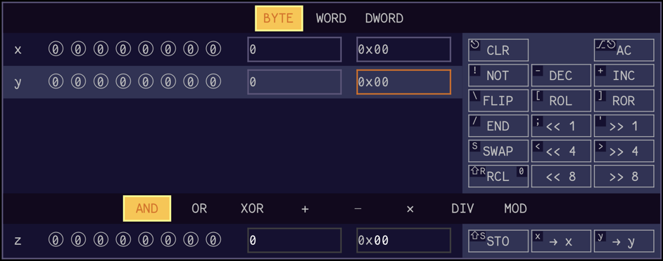

# bit-calc

A basic binary calculator. Written in JavaScript. I made it to help visualize basic bit manipulation operations.

## Guide

Set input values in the x and y registers in binary by clicking any bit to flip it or in decimal or hexadecimal by clicking a field and entering a number. The `Left` and `Right` arrow keys switch between decimal and hexadecimal input.

Then select an operation above the z register. The `Tab` key cycles through operations (`Shift`+`Tab` to cycle in reverse).

The answer is automatically computed and displayed in the z register whenever an input value or the selected operation changes. The answer cannot be edited in place, but you can use the `→ x` or `→ y` buttons next to the answer to copy it to one of the input registers (or use the `x` or `y` hotkeys).

The `Up` and `Down` arrows switch between the x and y registers. The adjoining buttons contain unary operations for manipulating bits in the selected register.

It is possible for the value in a register to exceed the selected data size. When this happens, the register name will be highlighted in red. The `` ` `` key cycles between data sizes (`Shift`+`` ` `` to cycle in reverse). If a result is less than zero, it will be highlighted in green.

## Acknowledgments

Uses [Fantasque](https://github.com/belluzj/fantasque-sans) font by [Jany Belluz](https://github.com/belluzj).

Uses "Cornered Stairs" background by [Matt Lipman](https://www.svgbackgrounds.com/).

## Authors

- J.C. Fields <jcfields@jcfields.dev>

## License

- [MIT license](https://opensource.org/licenses/mit-license.php)

## See also

- [EE Calc](https://github.com/jcfieldsdev/ee-calc)—A more conventional and fully featured calculator I wrote.
